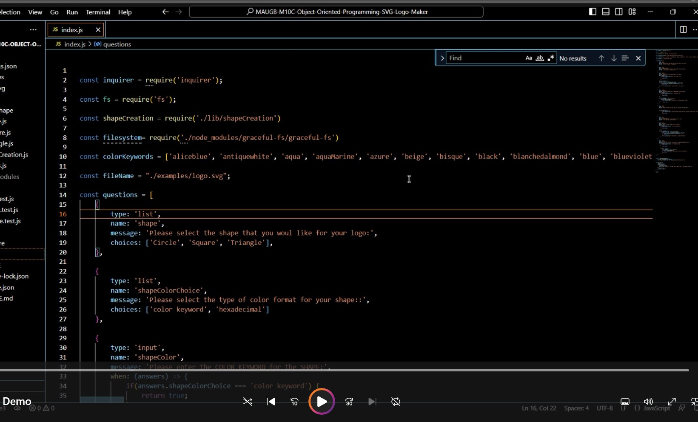

# Object Oriented programming, Create SVG logos automatically

## Description

This application uses Object oriented programing to create automatically a new Logo using SVG.
; user will be prompted with specific questions regarding the type of shapes and colors  that the user  has to answer in order the program to generate the new Logo.

This application uses modularization, practical use of NodeJS , interacting with Inquire package and fs to create SVG logo file. This program also performs some testing on the main shapes.

This s program helps to create automatically a professional SVG logo file, getting input from user and then generating the file. User is able to create many logos without the need to hire a graphic designer.

This program shows the use of NodeJS as backend JavaScript to be able to execute the JavaScript code outside of a web browser. This program allows us to utilize additional packages npm  for getting user input , processing and generating the logo on SVG format.

Use of NodeJS to write the main index file using JavaScript, use of  and Node JS; use of modularization, Install and use of npm package inquirer@8.2.4 and  jest 29.5.0 for this application. Use of SVG application.

## Table of Contents (Optional)

If your README is long, add a table of contents to make it easy for users to find what they need.

- [Installation](#installation)
- [Usage](#usage)
- [Credits](#credits)
- [License](#license)

## Installation

This program runs under node.js.  
Clone the repository.
Repository location https://github.com/MauricioGB1/MAUGB-M10C-Object-Oriented-Programming-SVG-Logo-Maker

Proceed to clone this repository.  Open in integrated terminal and then run : node index.js
Install npm inquirer@8.2.4 and  jest 29.5.0

## Usage

Provide instructions and examples for use. Include screenshots as needed.

To add a screenshot, create an `assets/images` folder in your repository and upload your screenshot to it. Then, using the relative file path, add it to your README using the following syntax:

Vide how to use the application:

User inqut, promted with questions to generate the logo

Example of logo creation

Example of logo creation 2

## Credits

= Generate license badge: https://shields.io/ .  
= Use of inquirer@8.2.4 package.
- Use of jets jest 29.5.0 package.
- Use of Scalable Vector Graphics (SVG).
- Use of NodeJs

## License

This program runs under the MIT license.

    MIT
    
  

## Features

- User input collection.
- Data selection options.
- Shapes are generated according to selection input.
- Shape and Text colors can be selected by color Keyword or by Hexadecimal number.
- Logo Images are created using Scalable Vector Graphics (SVG).

## How to Contribute

If you would like to contribute please send an e-mail to gomezb_mauricio@hotmail.com. Please share your GitHub repository name and your message.

## Tests

For test go to the section folder test. Open the integrated terminal an run npm Test. Test will proceed to execute.